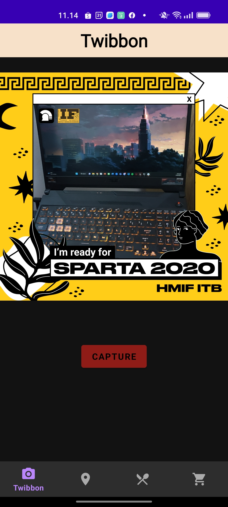

# IF3210-2023-Android-AAD

## Tugas Besar 1 Android
## Deskripsi
Aplikasi Majika merupakan aplikasi android mobile untuk melakukan pemebelian makanan. Aplikasi dibuat dengan Kotlin-Android Native dengan fitur sebagai berikut. 
1. Fitur Melihat Daftar Menu  
   //Tambahi Deskrpsi
2. Fitur Keranjang  
//Tambahi Deskrpsi
3. Fitur Pembayaran 
//Tambahi Deskrpsi
4. Fitur Melihat Daftar Cabang Restoran 
   Pada halaman ini, pengguna dapat melihat seluruh daftar cabang restoran. Pengguna juga dapat melihat restoran pada Google Maps setelah menekan tombol "MAPS" 
5. Fitur Membuat Twibbon 
   Pada halaman ini, pengguna dapat mengambil gambar dan membuat twibbon dengan twibbon yang telah tersedia dari aplikasi. Pengguna juga dapat mengambil ulang gambar untuk twibbon tersebut.

## Library
- Android KTX
- CameraX
- Retrofit
- Tambahi kalau ada

## Screenshots

- Daftar makanan dan minuman

- Keranjang

- Pembayaran

- Cabang Restoran

- Twibbon

## Pembagian Kerja serta Waktu persiapan dan pengerjaan
| NIM      | NAMA                       | TASK                                       |Total Jam                             |
|----------|----------------------------|--------------------------------------------|--------------------------------------|
| 13520120| Afrizal Sebastian           |Twibbon, Retrofit, Cabang Restoran          | 15 jam persiapan + 24 jam pengerjaan |
| 13520158 | Azmi Alfatih Shalahuddin   |Keranjang, Pembayaran                       |                                      |
| 13520159 | Atabik Muhammad Azfa Shofi |Header dan Navbar, Halaman Menu             |                                      |

